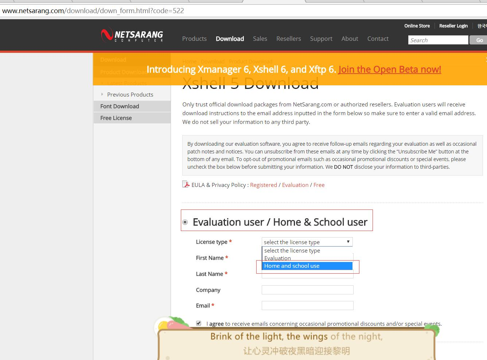
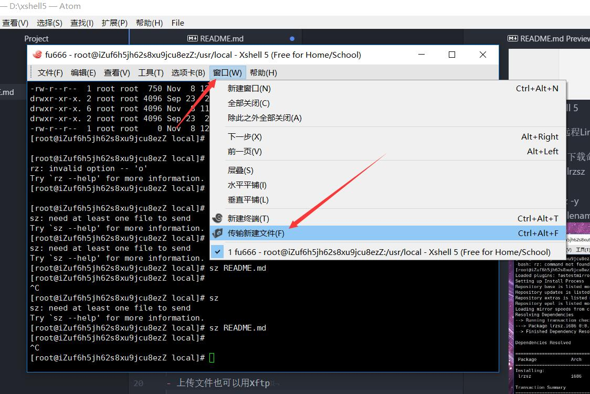
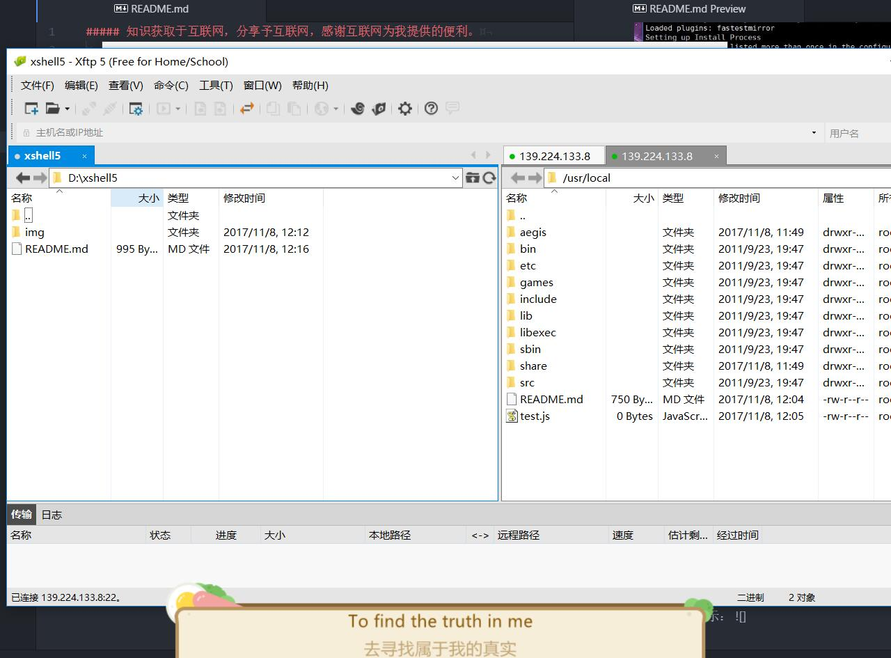

##### 用 xshell5 连接远程inux服务器.

- Xshell官网下载  Home&School 版本，此版本免费。  
    [下载地址](http://www.netsarang.com/download/down_form.html?code=522)（如果此连接失效，自行去Xshell官网找）     
    选择 Home&School版本，输入Email。Xshell官网会发邮件，邮件里有下载链接。  
    商用请用其他SSH工具，比如PUTTY,工具尽量去官方下载，国内下载站捆绑太多。
      
    
- 下载安装Xshell 5  

- 用Xshell登陆远程Linux服务器  
  新建->主机(H)（填写Ip）->用户名->密码
  
- 以Centos为例 yum安装上传下载命令 lrzsz   
  yum install -y lrzsz  
  上传:  rz   
  上传并覆盖: rz -y (例如:rz -y，选择code.zip压缩包)  
  解压: unzip filename  
  解压并覆盖: unzip -o filename (例如: unzip -o code.zip)  
  下载命令: sz  filename (例如: sz README.md)  
  PS: rz sz命令只能上传下载文件，文件夹要先打包成.zip
    
  

- 远程上传和下载也可以用可视化工具Xftp,[Xshell->窗口->传输新建文件]，  
  根据提示去官网下载 Home&School版Xftp
    
  
  可视化Xftp图示：
    
  
  ###### 知识获取于互联网，分享予互联网。
  

