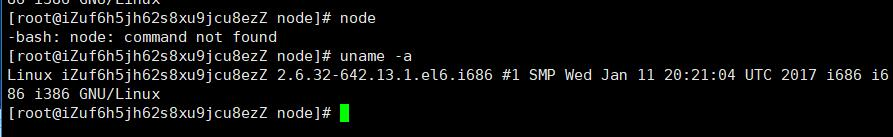
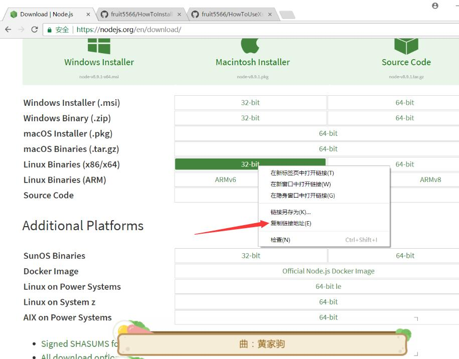
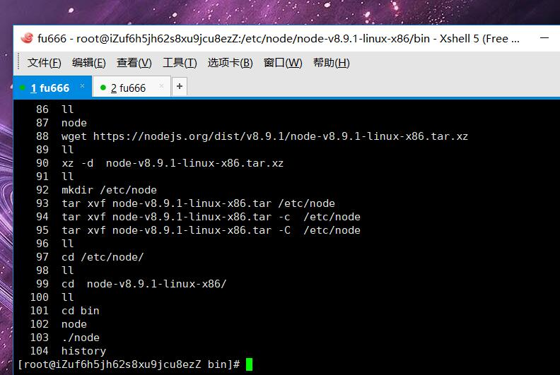
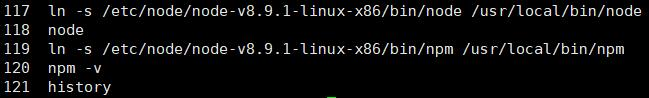
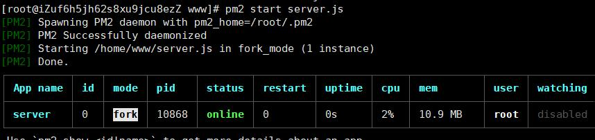
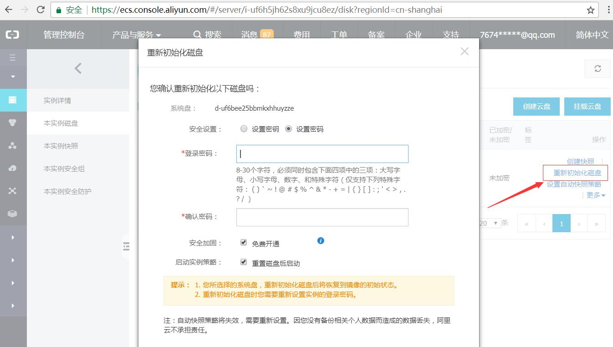

1. 命令行输入 uname -a 查看Linux版本 区分32位主机还是64位主机
  

2. 官网下载对应Node版本，选择免安装版本 Linux Binaries(x86/x64)  
下载nodexxx.tar.xz
  

3. 解压文件,
 本例创建/etc/node文件夹，用于放node解压文件  
 xz -d nodexxx.tar.xz  
 tar xvf nodexxx.tar  -C  /etc/node   
    
  
4. 此时只能在 nodexxx/bin目录下用 ./node命令  
 cd /etc/node/nodexxx/bin  
 ./node -v  
 
5. 创建全局node和npm命令，  
    ln -s /etc/node/nodexxx/bin/node    /usr/local/bin/node   
    ln -s /etc/node/nodexxx/bin/npm    /usr/local/bin/npm

6. 杂项  
        解压tar.xz文件：  
        先 xz -d xxx.tar.xz 将 xxx.tar.xz解压成 xxx.tar   
        然后，再用 tar xvf xxx.tar来解包。  
        解压到指定文件夹用 -C 参数
        Linux手动安装的软件，  
        [path]/xxx命令可以通过 ln -s 到 /usr/local/bin/xxx 的方式创建全局xxx命令
        
- 安装pm2   
  yum install -g pm2  
  ln -s   &nbsp; &nbsp;[path/pm2]  &nbsp;&nbsp; /usr/loccal/bin/pm2
  
  
          
        
-  为做本文档初始化了服务器      
           
        
        
        